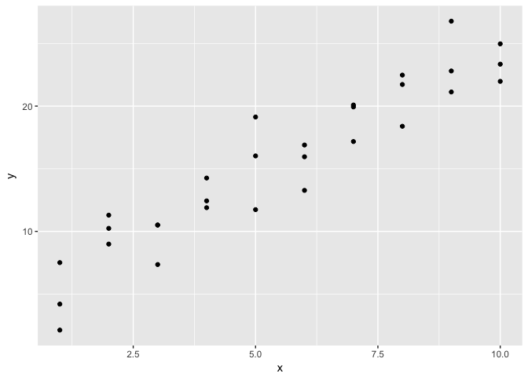
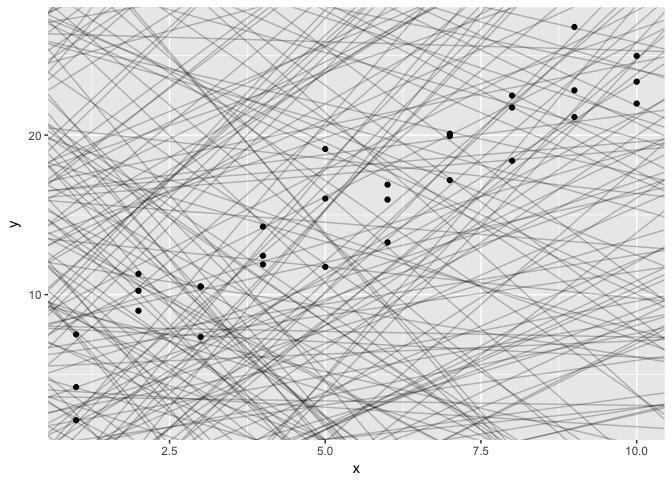
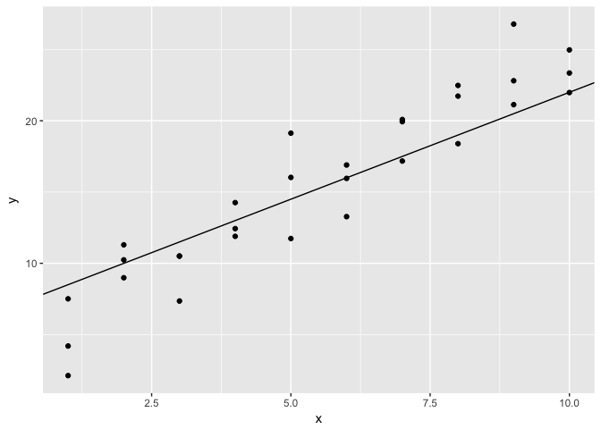
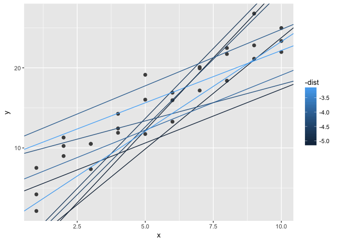
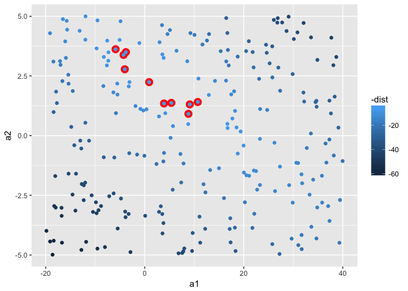
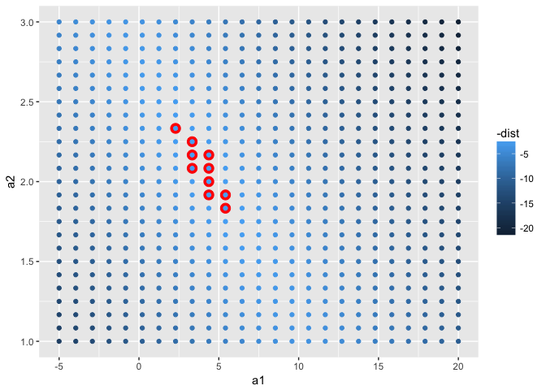
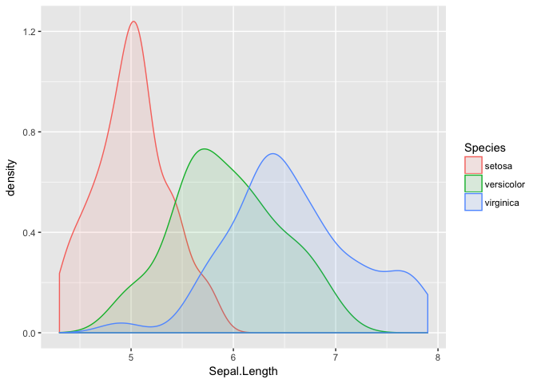

# Data Modeling & R
@laneharrison  
2/26/2017  

# Data Modeling

## Modeling - The Big Picture


## Modeling and You

Oftentimes we're looking for "significance":

- Some consistent effect between two or more groups (t.test, ANOVA, etc)
- An equation that describes a relationship (linear and other forms of modeling)

Where does this fit into your process?

## The approach


```r
library(tidyverse) # set of libraries
```

```
## Loading tidyverse: ggplot2
## Loading tidyverse: tibble
## Loading tidyverse: tidyr
## Loading tidyverse: readr
## Loading tidyverse: purrr
## Loading tidyverse: dplyr
```

```
## Conflicts with tidy packages ----------------------------------------------
```

```
## filter(): dplyr, stats
## lag():    dplyr, stats
```

```r
library(modelr)
options(na.action = na.warn)
```

## Let's model some data


```r
ggplot(sim1, aes(x, y)) + 
  geom_point()
```

<!-- -->


## Randomly generating models

```r
models <- tibble(
  a1 = runif(250, -20, 40),
  a2 = runif(250, -5, 5)
)

ggplot(sim1, aes(x, y)) + 
  geom_abline(aes(intercept = a1, slope = a2), data = models, alpha = 1/4) +
  geom_point() 
```

<!-- -->


## Applying a model


```r
model1 <- function(a, data) {
  a[1] + data$x * a[2]
}
model1(c(7, 1.5), sim1) # an example model's predictions
```

```
##  [1]  8.5  8.5  8.5 10.0 10.0 10.0 11.5 11.5 11.5 13.0 13.0 13.0 14.5 14.5
## [15] 14.5 16.0 16.0 16.0 17.5 17.5 17.5 19.0 19.0 19.0 20.5 20.5 20.5 22.0
## [29] 22.0 22.0
```

## Your turn

Produce a plot of the model c(7, 1.5) (intercept, slope)

Hint: start by plotting sim1 with points (as above)


```r
df <- tibble(
  b = 7,
  y = 1.5
) # remember, y = mx + b

# add ggplot here
```

## One solution


```r
ggplot(sim1) + 
  geom_abline(aes(intercept = b, slope = y), data = df) +
  geom_point(aes(x, y))
```

<!-- -->


## Model "error"

- "root mean square deviation"


```r
measure_distance <- function(mod, data) {
  diff <- data$y - model1(mod, data)
  sqrt(mean(diff ^ 2))
}
measure_distance(c(7, 1.5), sim1) # example model distance (average)
```

```
## [1] 2.665212
```

## Distance of Multiple Models


```r
sim1_dist <- function(a1, a2) {
  measure_distance(c(a1, a2), sim1)
} # using fucntion from before... 

# add "dist" col for each model
models <- models %>% 
  mutate(dist = purrr::map2_dbl(a1, a2, sim1_dist))
models # print results
```

```
## # A tibble: 250 × 3
##            a1         a2      dist
##         <dbl>      <dbl>     <dbl>
## 1   -9.419264  4.9423842  8.864555
## 2   34.881594 -0.2652795 19.232202
## 3   39.042743 -3.5280854 16.687104
## 4   24.811319  2.9401942 25.693960
## 5   -9.977704 -3.1933229 45.654863
## 6    5.282226 -1.1248924 18.895031
## 7   37.554378  4.4597693 47.137730
## 8   23.943527  1.0396891 14.608639
## 9    4.471778  3.9297442 12.066173
## 10 -18.192184 -3.0548763 52.628180
## # ... with 240 more rows
```

## 10 best models


```r
ggplot(sim1, aes(x, y)) + 
  geom_point(size = 2, colour = "grey30") + 
  geom_abline(
    aes(intercept = a1, slope = a2, colour = -dist), 
    data = filter(models, rank(dist) <= 10)
  )
```

<!-- -->

## Visualizing the model space!


```r
ggplot(models, aes(a1, a2)) +
  geom_point(data = filter(models, rank(dist) <= 10), size = 4, colour = "red") +
  geom_point(aes(colour = -dist))
```

<!-- -->

## Make a grid of models

```r
grid <- expand.grid(
  a1 = seq(-5, 20, length = 25),
  a2 = seq(1, 3, length = 25)
  ) %>% 
  mutate(dist = purrr::map2_dbl(a1, a2, sim1_dist))
```

## Plot our grid 

```r
grid %>% 
  ggplot(aes(a1, a2)) +
  geom_point(data = filter(grid, rank(dist) <= 10), size = 4, colour = "red") +
  geom_point(aes(colour = -dist)) 
```

<!-- -->


## Moving forward

- This was ch 23.1 & 23.2 in R4DS
- The rest of 23 includes: interactions, transformations, etc

# Switching gears -- basic hypothesis testing & estimation

## Iris Sepal Lengths: Are these significantly different?


```r
iris %>% 
  ggplot(aes(Sepal.Length)) +
  geom_density(aes(fill = Species, colour = Species), alpha=0.1) 
```

<!-- -->

## Running a t.test


```r
t.test( filter(iris, Species == "setosa")$Sepal.Length,
        filter(iris, Species == "virginica")$Sepal.Length) 
```

```
## 
## 	Welch Two Sample t-test
## 
## data:  filter(iris, Species == "setosa")$Sepal.Length and filter(iris, Species == "virginica")$Sepal.Length
## t = -15.386, df = 76.516, p-value < 2.2e-16
## alternative hypothesis: true difference in means is not equal to 0
## 95 percent confidence interval:
##  -1.78676 -1.37724
## sample estimates:
## mean of x mean of y 
##     5.006     6.588
```

## Your turn: Running a ???

Run some other test on the data. Maybe change the variables, maybe try a different test (e.g. ANOVA).

Hint: to find other tests, use Google, Stack Overflow and keep an eye out for Quick-R


