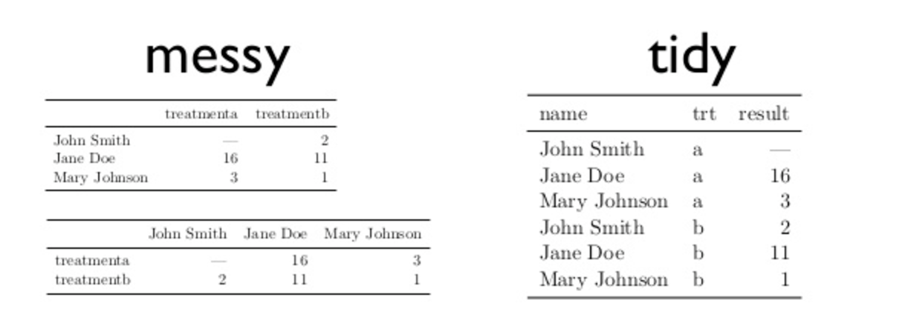

## Data Wrangling

A large part of data-driven science involves data manipulation.

Some studies find that analysts estimate 80% of their time is spent on data collection and wrangling, with 20% left to analysis and visualization.

## Data Wrangling and You

What will this balance look like for you?

Do you:

- Conduct the same analyses over and over with different parameters?
- Have to occasionally grab data from outside sources and merge it with your own labs' data?
- Work in a team?
- Re-use your own analyses later on slightly different data?

## Tidy data

"Tidy" data is a set of principles and tools that ensure your data is compatible with a large number of statistical and visualization techniques.


(Read more about [Tidy data](https://www.jstatsoft.org/index.php/jss/article/view/v059i10/v59i10.pdf).)

## Tidy data, an example



## Tidy data, an example in biology

- [https://bioramble.wordpress.com/2015/11/27/taking-up-the-cudgels-for-tidy-data/](https://bioramble.wordpress.com/2015/11/27/taking-up-the-cudgels-for-tidy-data/)

# Data Transformation

## Loading Data and Libs

```{r}
library(nycflights13) # flight data (built in)
library(tidyverse) # set of libraries
```

## Testing that our Data Loaded

```{r}
flights
```

## Testing that our Data Loaded, with the built in Viewer

Use `View(flights)`. Try it now!

The viewer will be essential for you to verify that your manipulation of data has the intended effect.

## `dplyr`: a data manipulation tool

- Pick observations by their values (filter()).
- Reorder the rows (arrange()).
- Pick variables by their names (select()).
- Create new variables with functions of existing variables (mutate()).
- Collapse many values down to a single summary (summarise()).

(- R4DS Section 5.1.3)

## `filter` flights on particular date
```{r}
# note: wrap assignments in parentheses to see the output, otherwise this is hidden
(dec25 <- filter(flights, month == 12, day == 25))
```

## `filter` flights conditionally
```{r}
(nov_dec <- filter(flights, month %in% c(11, 12)))
# same as filter(flights, month == 11 | month == 12)
```

## `filter` flights with delays less than two hours
```{r}
filter(flights, arr_delay <= 120, dep_delay <= 120)
# same as filter(flights, !(arr_delay > 120 | dep_delay > 120))
```

## `arrange()`

`filter` filters rows; `arrange` changes their order

## `arrange()` by year, month, then day
```{r}
#arrange(flights, year, month, day)
arrange(flights, desc(dep_time), month, day)
```

## `select()`

`select` allows you to remove columns to focus on the ones you need. This can help performance and readability. 

```{r}
select(flights, year, month, day)
# Select all columns between year and day (inclusive)
#select(flights, year:day)
```

## `select()` helper functions

- starts_with("abc"): matches names that begin with “abc”.
- ends_with("xyz"): matches names that end with “xyz”.
- contains("ijk"): matches names that contain “ijk”.
- matches("(.)\\1"): selects variables that match a regular expression. This one matches any variables that contain repeated characters. You’ll learn more about regular expressions in strings.
- num_range("x", 1:3) matches x1, x2 and x3.

(- R4DS Section 5.4 )


## `rename` to rename columns

Note: the rename syntax is weird. We thought it did not work in class, when infact it's a "backwards assignment".
The original variable is tailnum, and we are changing it to tail_num.

```{r}
rename(flights, tail_num = tailnum)
```

## `mutate` to add variables
```{r}
# create a small dataset to see the value of mutate 
# (it adds variables at the end)
flights_sml <- select(flights, 
  year:day, 
  ends_with("delay"), 
  distance, 
  air_time
)

mutate(flights_sml,
  gain = arr_delay - dep_delay,
  speed = distance / air_time * 60
)
```

## `mutate` using columns you just created to create new columns
```{r}
mutate(flights_sml,
  gain = arr_delay - dep_delay,
  hours = air_time / 60,
  gain_per_hour = gain / hours
)
```

## `summarise` for grouped summaries (important!)

```{r}
# to one value
summarise(flights, delay = mean(dep_delay, na.rm = TRUE))
```

## adding `group_by`
```{r}
# mean delay by year month day
by_day <- group_by(flights, year, month, day)
summarise(by_day, delay = mean(dep_delay, na.rm = TRUE))
```

## putting it together
```{r}
by_dest <- group_by(flights, dest)
delay <- summarise(by_dest,
  count = n(),
  dist = mean(distance, na.rm = TRUE),
  delay = mean(arr_delay, na.rm = TRUE)
)
(delay <- filter(delay, count > 20, dest != "HNL"))
```

## putting it together
```{r}
ggplot(data = delay, mapping = aes(x = dist, y = delay)) +
  geom_point(aes(size = count), alpha = 1/3) +
  geom_smooth(se = FALSE)
```

## putting it together
```{r, echo=FALSE}
ggplot(data = delay, mapping = aes(x = dist, y = delay)) +
  geom_point(aes(size = count), alpha = 1/3) +
  geom_smooth(se = FALSE)
```

## putting it together, better
```{r}
delays <- flights %>% 
  group_by(dest) %>% 
  summarise(
    count = n(),
    dist = mean(distance, na.rm = TRUE),
    delay = mean(arr_delay, na.rm = TRUE)
  ) %>% 
  filter(count > 20, dest != "HNL")
```


## Why not use built-in R functions?

`dplyr` provides interoperability: the output of one function can serve as the input to another


